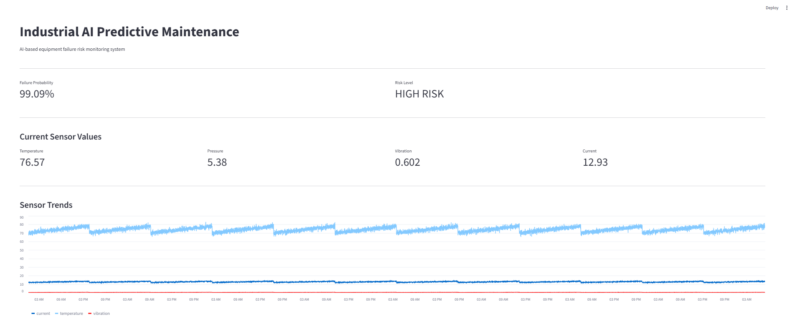

# AI 工業設備預知維護系統

**AI-Based Predictive Maintenance System**

---

## 專案介紹

本專案是一個以人工智慧（Artificial Intelligence, AI）與機器學習（Machine Learning, ML）為核心的工業設備預知維護系統原型。

系統透過模擬工業設備的感測器資料，分析設備運作狀態，並利用機器學習模型預測設備發生故障的可能性。

完整系統流程：

```text
工業感測器資料
      ↓
資料前處理
      ↓
特徵工程
      ↓
機器學習
      ↓
故障預測
      ↓
風險評估
      ↓
Dashboard
```

> **注意：** 目前使用的資料為自行產生的模擬工業感測器資料，主要用於研究、學習與作品集展示，並非來自真實工廠設備。

---

## 專案目標

本專案希望建立一個完整的 Industrial AI 基礎系統。

主要目標：

* 分析工業設備感測器資料
* 找出設備故障相關特徵
* 建立機器學習故障預測模型
* 比較不同機器學習模型
* 分析 Precision、Recall 與 F1 Score
* 分析不同 Threshold 對模型的影響
* 使用 SHAP 進行 Explainable AI 分析
* 將模型結果轉換成設備風險等級
* 建立設備監控 Dashboard

---

## 系統架構

```text
                    工業設備感測器資料
                            │
                            ▼
                        資料前處理
                            │
                            ▼
                         特徵工程
                            │
                            ▼
              ┌─────────────────────┐
              │     機器學習模型     │
              │                     │
              │   Random Forest     │
              │   Gradient Boosting │
              │   XGBoost           │
              └─────────────────────┘
                            │
                            ▼
                      故障發生機率
                            │
                            ▼
                         風險評估
                            │
                            ▼
                    Streamlit Dashboard
```

---

## 感測器資料

目前系統使用四種主要感測器：

| 感測器         | 說明   |
| ----------- | ---- |
| Temperature | 設備溫度 |
| Pressure    | 設備壓力 |
| Vibration   | 機械振動 |
| Current     | 電流   |

資料另外包含：

| 欄位         | 說明     |
| ---------- | ------ |
| timestamp  | 資料時間   |
| machine_id | 設備編號   |
| failure    | 是否發生故障 |

本專案透過模擬設備隨時間逐漸劣化的狀態，建立具有時間變化的工業感測器資料。

---

## 特徵工程

除了原始感測器數值之外，本專案進一步建立時間相關特徵。

### 感測器變化量

計算相鄰時間點之間的變化：

* `temperature_change`
* `vibration_change`
* `current_change`

這些特徵用來描述設備感測器數值是否正在快速變化。

### 移動平均

計算最近一段時間的平均值：

* `temperature_rolling_mean`
* `vibration_rolling_mean`
* `current_rolling_mean`

透過這些特徵，模型除了可以觀察目前的感測器數值，也可以觀察設備近期的狀態。

---

## 機器學習模型

本專案比較三種機器學習模型：

1. Random Forest
2. Gradient Boosting
3. XGBoost

資料採用依照時間順序切分的方式：

```text
歷史資料
    ↓
Training Data
    ↓
Machine Learning Model
    ↓
未來資料
    ↓
Testing Data
```

這種資料切分方式可以避免完全隨機切分造成的時間資訊混合，並較接近設備實際監控的情境。

---

## 模型結果

目前使用模擬工業資料進行測試，結果如下：

| 模型                | Accuracy | Precision |  Recall |      F1 |
| ----------------- | -------: | --------: | ------: | ------: |
| Random Forest     |  97.999% |   96.491% | 97.015% | 96.752% |
| Gradient Boosting |  98.624% |   97.439% | 98.100% | 97.769% |
| XGBoost           |  98.083% |   96.252% | 97.558% | 96.900% |

> **注意：** 以上結果為目前模擬資料上的測試結果，不能直接代表模型在真實工業設備上的實際表現。

未來若使用真實工業資料，需要重新進行資料清理、特徵設計、模型驗證與效能評估。

---

## Threshold Analysis

機器學習模型除了可以輸出「是否故障」，也可以輸出設備發生故障的預測機率。

例如：

```text
Failure Probability
        │
        ▼
       0.82
        │
        ▼
    高風險設備
```

不同的判斷門檻會影響：

* Precision
* Recall
* F1 Score

因此本專案測試不同 Threshold，觀察不同門檻下模型表現的變化。

Threshold Analysis 的主要目的，是了解：

> 提高故障偵測敏感度與減少誤報之間的取捨。

目前的 Threshold Analysis 主要用於分析 Precision 與 Recall 的關係，並沒有宣稱某一個 Threshold 是真實工業環境中的最佳值。

---

## SHAP 模型解釋

本專案使用 **SHAP（SHapley Additive exPlanations）** 進行 Explainable AI 分析。

SHAP 可以用來分析：

> 為什麼模型會做出這個預測？

主要包含兩種分析。

### Feature Importance

分析哪些特徵對模型整體預測影響較大。

### Feature Impact

分析不同特徵數值對模型預測結果的影響方向。

因此系統不只是：

```text
預測設備可能故障
```

還可以進一步分析：

```text
哪些感測器特徵
影響了模型的預測
```

這可以增加機器學習模型在工業應用中的可解釋性。

---

## 設備風險評估

系統將模型預測出的故障機率轉換成三種風險等級：

```text
故障機率 < 0.50
        ↓
     LOW RISK


0.50 ～ 0.79
        ↓
   MEDIUM RISK


故障機率 ≥ 0.80
        ↓
    HIGH RISK
```

目前使用的 Threshold 是本專案的展示用規則。

在真實工業環境中，實際警報門檻應根據：

* 歷史故障資料
* 維修成本
* 設備重要程度
* 安全要求
* 停機成本
* 工程師與領域專家知識

進行設定。

---

## Streamlit Dashboard

本專案建立 Streamlit Dashboard，用於呈現設備目前狀態。

### Dashboard Preview



Dashboard 包含：

* Failure Probability
* Risk Level
* Temperature
* Pressure
* Vibration
* Current
* 感測器趨勢
* 最近的設備資料

啟動 Dashboard：

```bash
python -m streamlit run app.py
```

啟動後可以透過瀏覽器查看設備監控介面。

---

## 專案結構

```text
ai-industrial-data-analysis/
│
├── app.py
├── README.md
├── requirements.txt
├── .gitignore
│
├── data/
│   ├── machine_data.csv
│   ├── machine_features.csv
│   └── threshold_results.csv
│
├── src/
│   ├── generate_data.py
│   ├── feature_engineering.py
│   ├── train_models.py
│   ├── threshold_analysis.py
│   ├── shap_analysis.py
│   ├── predict_risk.py
│   └── explore_data.py
│
└── results/
    ├── dashboard.png
    ├── shap_feature_importance.png
    └── shap_feature_impact.png
```

---

## 使用技術

### Programming

* Python

### Data Processing

* NumPy
* Pandas

### Machine Learning

* Scikit-learn
* XGBoost

### Explainable AI

* SHAP

### Visualization

* Matplotlib
* Streamlit

### Version Control

* Git
* GitHub

---

## 如何執行

### 1. 安裝套件

```bash
pip install -r requirements.txt
```

### 2. 產生工業感測器資料

```bash
python src/generate_data.py
```

### 3. 進行特徵工程

```bash
python src/feature_engineering.py
```

### 4. 訓練與比較模型

```bash
python src/train_models.py
```

### 5. 進行 Threshold Analysis

```bash
python src/threshold_analysis.py
```

### 6. 進行 SHAP 分析

```bash
python src/shap_analysis.py
```

### 7. 進行設備風險評估

```bash
python src/predict_risk.py
```

### 8. 啟動 Dashboard

```bash
python -m streamlit run app.py
```

---

## 專案目前成果

目前已完成：

* 工業感測器資料產生
* 時間序列資料處理
* Feature Engineering
* Random Forest
* Gradient Boosting
* XGBoost
* 多模型效能比較
* Threshold Analysis
* SHAP Explainable AI
* Failure Risk Assessment
* Streamlit Dashboard

目前已建立一套從資料到應用介面的完整流程：

```text
Sensor Data
      ↓
Feature Engineering
      ↓
Machine Learning
      ↓
Failure Prediction
      ↓
Risk Assessment
      ↓
Dashboard
```

---

# 未來發展

本專案目前是 Industrial AI 的第一階段原型。

未來將逐步提升系統的資料、模型與應用能力。

## Phase 1：強化 Machine Learning

* 使用真實工業資料集
* 更嚴謹的時間序列驗證
* Anomaly Detection
* Remaining Useful Life（RUL）預測
* Hyperparameter Optimization
* Cost-sensitive Learning
* Model Monitoring

## Phase 2：多設備監控

目前系統主要以單一模擬設備為核心。

未來可以擴展到多台設備：

```text
Machine 001 ─┐
Machine 002 ─┤
Machine 003 ─┼──► Industrial AI Platform
Machine 004 ─┤
Machine 005 ─┘
```

建立多設備的集中式設備健康監控系統。

## Phase 3：Industrial AI Platform

未來可以進一步整合：

* 即時感測器資料
* Database
* 自動警報
* 維修決策支援
* Model Monitoring
* Interactive Dashboard
* API

形成較完整的 Industrial AI Platform。

## Phase 4：Digital Twin 與 Robotics

長期可以進一步整合：

* Digital Twin
* Industrial Robot Simulation
* Isaac Sim
* ROS
* Robot Motion Analysis
* Human-to-Robot Interaction
* AI-driven Manufacturing

最終希望將目前的資料分析與機器學習能力，逐步延伸到智慧製造、機器人與數位孿生應用。

---

## 長期發展方向

本專案的長期方向，是逐步整合：

```text
Industrial Engineering
        +
Artificial Intelligence
        +
Machine Learning
        +
Industrial Data
        +
Robotics
        +
Digital Twin
```

從目前的：

```text
工業資料分析
      ↓
預知維護
```

逐步延伸至：

```text
工業資料
    ↓
AI 分析
    ↓
設備健康預測
    ↓
維修決策
    ↓
智慧製造
    ↓
Digital Twin
    ↓
Robotics
```

藉此建立一個具有 Industrial AI、智慧製造與機器人整合方向的長期 GitHub Portfolio。

---

## 專案定位

本專案不是單純的機器學習練習，而是作為長期 Industrial AI Portfolio 的第一個完整作品。

目前建立的核心能力包括：

```text
Python
  ↓
Data Analysis
  ↓
Feature Engineering
  ↓
Machine Learning
  ↓
Explainable AI
  ↓
Risk Assessment
  ↓
Dashboard
```

後續將在此基礎上逐步加入：

```text
Real Industrial Data
        ↓
Advanced Time-Series ML
        ↓
Anomaly Detection
        ↓
RUL Prediction
        ↓
Industrial AI
        ↓
Digital Twin
        ↓
Robotics
```

---

## 作者

本專案為長期 Industrial AI GitHub Portfolio Project。

目標是逐步整合：

**工業工程 + 人工智慧 + 機器學習 + 工業資料分析 + 機器人 + Digital Twin**

建立具備實際技術深度與持續發展性的智慧製造作品集。
